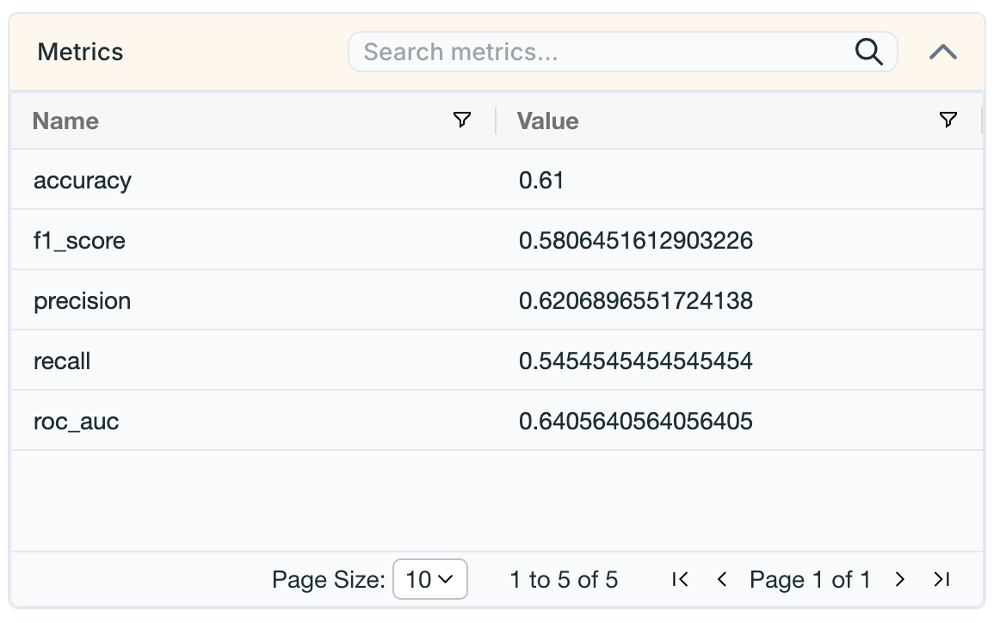
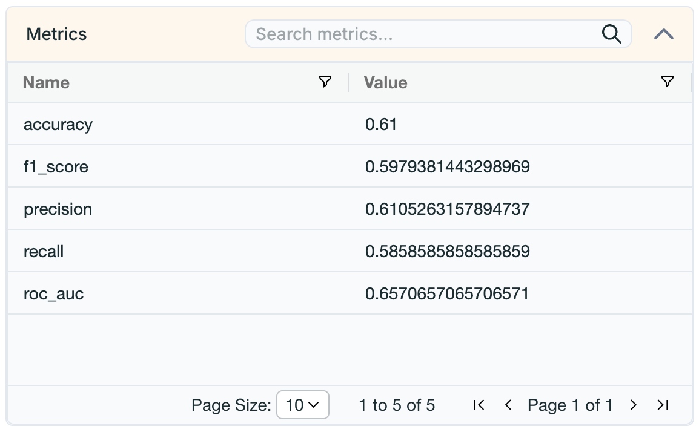

#  SmartCare No-Show AI — XGBoost & Random Forest Module

Hi, I’m **Heshan Thilakawardena**! I am responsible for developing, training, and evaluating the **XGBoost** and **Random Forest** machine learning models for the SmartCare No-Show AI system. Additionally, I built the preprocessing and feature engineering pipelines and configured **DAGsHub** and **MLflow** for experiment tracking and artifact storage.

---

##  Features & Responsibilities

* **XGBoost & Random Forest Modeling**: Built, trained, and evaluated XGBoost and Random Forest classifiers to predict patient appointment no-shows.
* **Preprocessing Pipeline**: Implemented robust data loading, cleaning, and encoding pipelines (`load_and_preprocess_data`) to prepare features for model training.
* **Experiment Tracking & Artifact Management**: Integrated **MLflow** and **DAGsHub** to track hyperparameters, performance metrics, and automatically log model artifacts and confusion matrices.
* **Performance Evaluation**: Generated classification reports, ROC-AUC curves, and confusion matrix heatmaps to analyze model predictions.

---

##  Task List

- [x] Implement Data Preprocessing & Feature Encoding Pipeline
- [x] Train Random Forest Classifier (`balanced` class weighting, parameter tuning)
- [x] Train XGBoost Classifier (`logloss` metric, hyperparameter tuning)
- [x] Track experiments and metrics via MLflow & DAGsHub
- [x] Save trained model objects (`.joblib`) for deployment

---

##  For Developers

### For Developers
- Download Code
- Install Esenntial libraries      
  ```bash
  pip install requirements.txt
  ```

- Start Training
  ```bash
  python src/train.py
  ```
# XGBoost


# Random_Forest



### Contibutor
- [Hehsan Thilakawadhana](https://github.com/heshanthilakawardena)