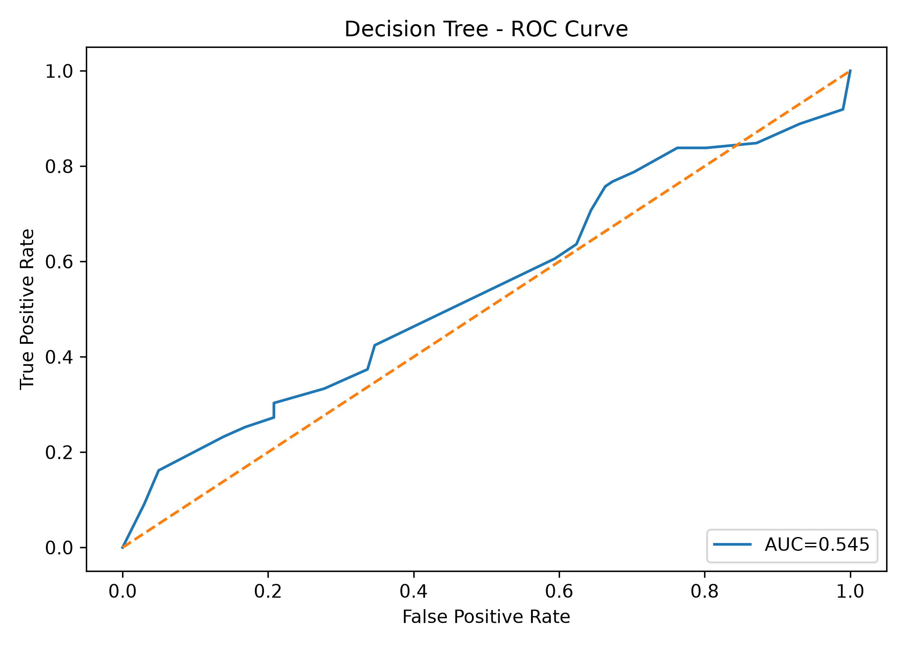

# SmartCare Agent Console Developer

Hi, I’m [Zahra](https://github.com/Zahra-Ismail). I am responsible for training and implementing the **Decision Tree** model for this project. I also developed the **Flask server** to connect the **Machine Learning models** with the application and worked on the client-side development to provide a user-friendly interface.

### Task list
- [x] Training Decision Tree model
- [x] Track model using `MLflow`
- [x] Save Model Artifacts in [**Dagshub**](https://dagshub.com/heshan.thilakawardena/smartcare-noshow-ai/experiments)
- [ ] Data versioning using `dvc`
- [x] `SHAP` implement for Explanations
- [x] Frontend using `Bootstrap` + `Flask`
- [x] `exe` Ready

### For Developers
- Download Code
- Install Essential libraries     

```

pip install -r requirements.txt

```
- Start Training

```

python main.py

```

# Decision Tree Model

### Confusion Matrix


### ROC


# Folder Structure


```

training/
└── DecisionTree/
├── data/
│   ├── processed/
│   └── raw/
│
├── model/
│
├── reports/
│   └── Decision_Tree/
│       ├── confusion_matrix.png
│       └── roc_curve.png
│
├── src/
│   ├── preprocessing/
│   │   ├── CleanData.py
│   │   ├── LoadData.py
│   │   ├── preprocess.py
│   │   └── SaveObjects.py
│   │
│   ├── training/
│   │   ├── evaluate.py
│   │   └── train.py
│   │
│   └── utils/
│       ├── mlflow_tracker.py
│       └── path.py
│
├── .env
└── main.py

```

## Contributor

- [Zahra Ismail](https://github.com/Zahra-Ismail)

```
