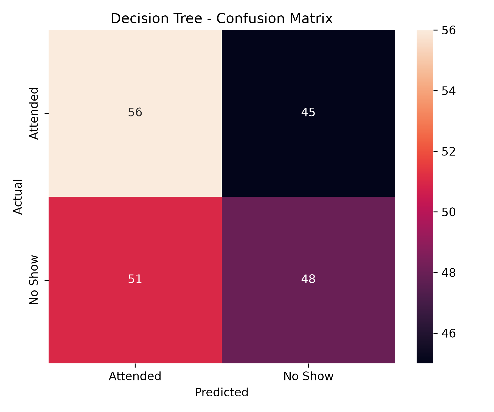
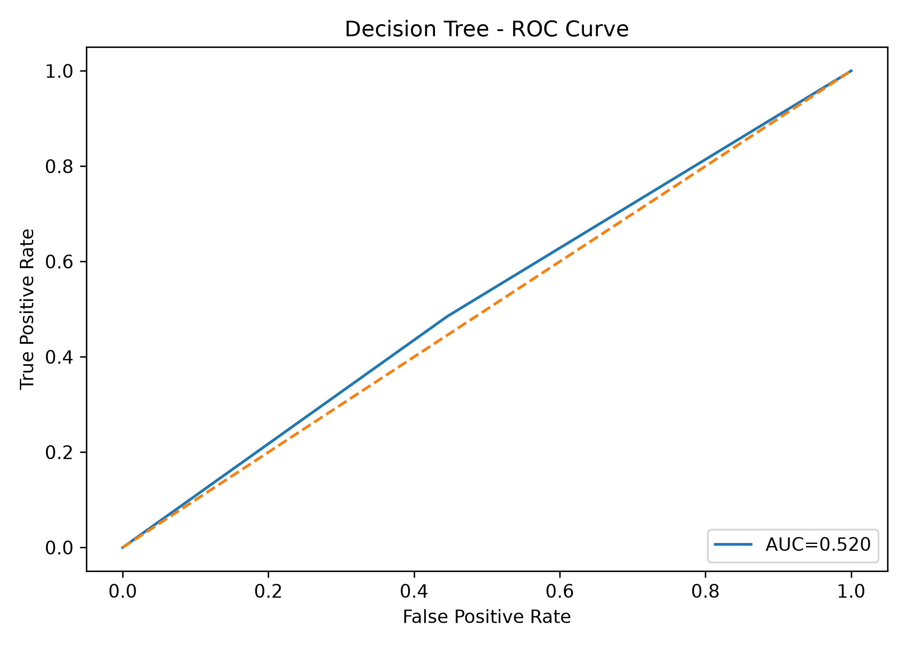

SmartCare Hospital AI
Our AI-powered prediction system uses Machine Learning models such as Decision Tree to identify patients who are more likely to miss their appointments before the scheduled date. It helps healthcare providers understand potential no-shows, take early actions such as reminders or follow-ups, and improve appointment management.

Task list
[x] Training Decision Tree model

[X] Track model using MLflow

[x] Save Model Artifacts in [**Dagshub**](https://dagshub.com/heshan.thilakawardena/smartcare-noshow-ai/experiments)

[ ] Data versioning using dvc

[x] SHAP implement for Explanations

[x] Frontend using Bootstrap + Flask

[x] exe Ready

### Usage
- Download Code
- Install Esenntial libraries      
  ```
  pip install requirements.txt
  ```
- Run code in terminal
  ```
  python app.py
  ```
  
Decision Tree Model

### Confusion Matrix


### ROC



System Architecture
                 User
                  |
                  |
             Bootstrap UI
                  |
        Select Model Dropdown
                  |
                  |
        POST JSON Request
                  |
                  ↓
              Flask API
                  |
                  |
            Decision Tree
                  |
          Smartcare_DecisionTree
                  |
                  ↓
      Smartcare_Preprocessor.joblib
                  |
                  ↓
              Prediction
                  |
                  ↓
  SHAP + Smartcare_Preprocessor.joblib
                  |
                  ↓
         Result back to UI
THANK YOU !!
