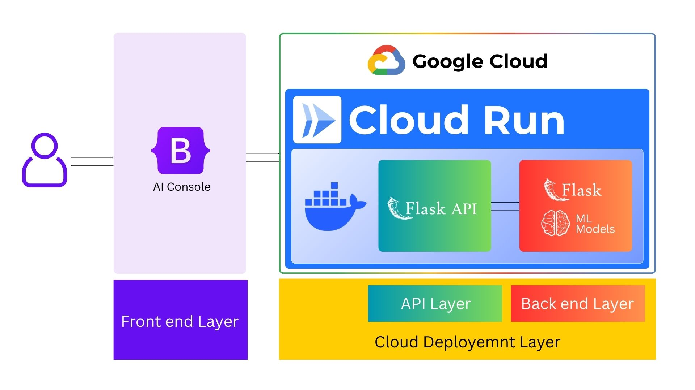

<p align="center">
  
</p>

# SmartCare Cloud Deployment Architecture

## 1. Overview

The system uses a **layered cloud deployment architecture** where the user interacts with an AI Console, while the machine learning application is deployed on **Google Cloud Run** using a Docker container.

The architecture consists of:

1. Frontend Layer
2. Cloud Deployment Layer
3. API Layer
4. Backend / ML Model Layer

The main communication flow is:

```text
User
  │
  ▼
AI Console
  │
  │ HTTP Request
  ▼
Google Cloud Run
  │
  ▼
Docker Container
  │
  ├── Flask API
  │      │
  │      ▼
  │   ML Models
  │      │
  │      ▼
  │   Prediction
  │
  ▼
HTTP / JSON Response
  │
  ▼
AI Console
  │
  ▼
User
```

## Cloud Deployment

The application is deployed using **Google Cloud Run**.Cloud Run is a managed container platform that runs the application without requiring the developer to manage a traditional server.The application is packaged inside a **Docker container**.

The Docker container contains the required application components, such as:

- Python environment
- Flask
- Application code
- ML libraries
- Trained ML models
- Model dependencies
- Supporting files

Therefore, the complete application can be deployed as a containerized service.

```text
Google Cloud Run
       │
       ▼
Docker Container
       │
       ├── Flask API
       ├── ML Models
       ├── Python
       └── Dependencies
```

## Layer Responsibilities

| Layer                  | Component        | Main Responsibility                  |
| ---------------------- | ---------------- | ------------------------------------ |
| Frontend Layer         | AI Console       | User interaction and result display  |
| Cloud Deployment Layer | Google Cloud Run | Run and manage the container         |
| Container Layer        | Docker           | Package application and dependencies |
| API Layer              | Flask API        | Handle HTTP requests and responses   |
| Backend Layer          | ML Models        | Perform machine learning inference   |

Therefore, **Cloud Run is the deployment platform**, Flask is the **API layer**, and the machine learning models form the **backend processing layer**.

This architecture allows the frontend and backend to remain logically separated while Cloud Run provides a scalable environment for running the containerized Flask and ML application.

### Contibutor
- [Hehsan Thilakawadhana](https://github.com/heshanthilakawardena)