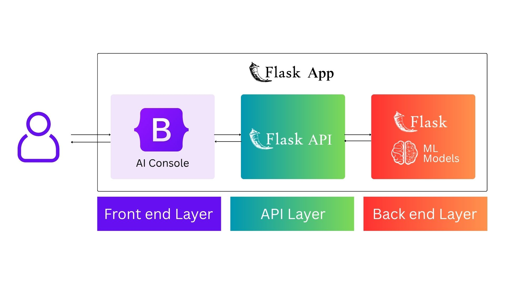

<p align="center">
  
</p>

# SmartCare Hospital AI Agent Console

Our AI powered prediction system uses Machine Learning models to identify patients who are more likely to miss their appointments before the scheduled date. It helps healthcare providers understand potential no-shows, take early actions such as reminders or follow-ups, and improve appointment management.

in this project we have two deployments Cloud base deploy ment and local ai deployment


### Available Models
- Logistic Regression
- KNN
- XGBosst
- Random Forest
- Desicion Tree

## Dual Deployment Architecture

The project is designed with a **flexible dual deployment architecture**, supporting both **Cloud Based Deployment** and **Local AI Deployment**.

### Agent Console Architecutre
- #### Local AI Architecture
<p align="center">
  
</p>

- #### Cloud Deployment Architecture
<p align="center">
  
</p>


### 1. Cloud Based Deployment

The SmartCare cloud deployment provides a centralized, scalable, and highly accessible environment. Application services and AI capabilities are hosted in the cloud, enabling users to access the system remotely while benefiting from cloud infrastructure, scalability, centralized management, and seamless integration with external services.

```URL
https://smartcare-noshow-ai-601188730984.asia-southeast1.run.app/
```
#### [**CLOUD DEPLOYMENT BRANCH**](https://github.com/heshanthilakawardena/smartcare-noshow-ai/tree/cloud-run-deployment)

### 2. Local AI Deployment

The SmartCare local AI deployment enables AI models and inference services to operate within the local environment. This approach provides greater control over data, enhanced privacy, reduced dependency on external services, and the ability to operate with lower latency or in environments with limited internet connectivity.

#### System Architecture

The application is divided into three main layers and is designed for local AI deployment:

- Frontend Layer – AI Console:
  The user interacts with the AI Console through the web interface. It collects the user's input and displays the prediction results.
- API Layer – Flask API:
  The Flask API acts as a bridge between the frontend and backend. It receives requests from the AI Console, sends the data to the locally deployed ML models, and returns the prediction results.
- Backend Layer – Flask + ML Models:
  The Flask backend runs locally on the user's computer and loads the machine learning models stored locally. It processes the received data, makes predictions, and sends the results back to the API.

The AI models are deployed and executed locally rather than using a remote AI or cloud server. This allows predictions to be performed directly on the user's machine without sending data to an external AI service.

### Usage
- [Download `SmartCare.zip`](https://github.com/heshanthilakawardena/smartcare-noshow-ai/releases/tag/v1.0)
- Run the `SmartCare.exe`

### Deployment Flexibility

This dual deployment approach allows the project to adapt to different operational requirements. Organizations can leverage the **scalability and accessibility of cloud infrastructure** or choose **local AI processing for greater privacy, control, and independence**.

Together, these two deployment models provide a robust, flexible, and future ready architecture capable of supporting diverse deployment and business requirements.

### Contibutors
- [Hehsan Thilakawadhana](https://github.com/heshanthilakawardena)
- [Zahra Ismail](https://github.com/Zahra-Ismail)
- [Binara Wijewickrama](https://github.com/binarays)