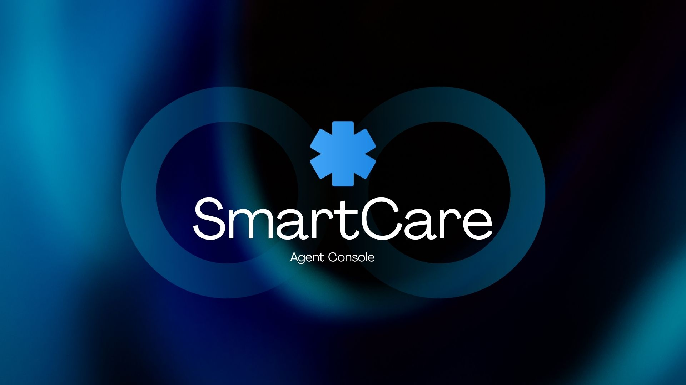
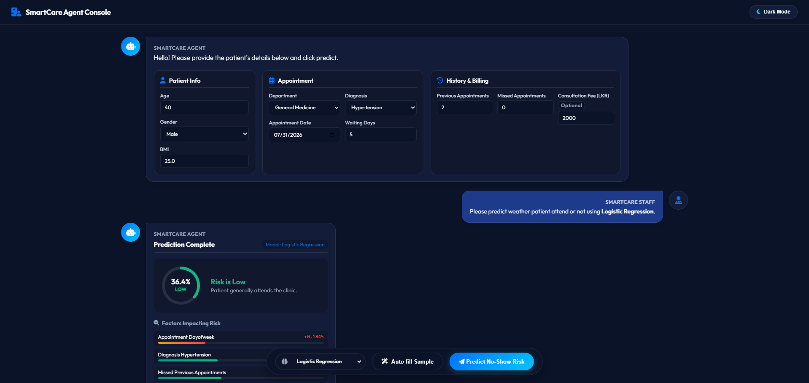

<p align="center">
  
</p>

# SmartCare Hospital AI Agent Console

Our AI powered prediction system uses Machine Learning models to identify patients who are more likely to miss their appointments before the scheduled date. It helps healthcare providers understand potential no-shows, take early actions such as reminders or follow-ups, and improve appointment management.

in this project we have two deployments Cloud base deploy ment and local ai deployment


## Dual Deployment Architecture

The project is designed with a **flexible dual-deployment architecture**, supporting both **Cloud-Based Deployment** and **Local AI Deployment**.

### 1. Cloud-Based Deployment

The cloud deployment provides a centralized, scalable, and highly accessible environment. Application services and AI capabilities are hosted in the cloud, enabling users to access the system remotely while benefiting from cloud infrastructure, scalability, centralized management, and seamless integration with external services.

```URL
https://smartcare-noshow-ai-601188730984.asia-southeast1.run.app/
```

### 2. Local AI Deployment

The local AI deployment enables AI models and inference services to operate within the local environment. This approach provides greater control over data, enhanced privacy, reduced dependency on external services, and the ability to operate with lower latency or in environments with limited internet connectivity.

### Usage
- Download Code
  ```bash
  git clone -b main --single-branch https://github.com/heshanthilakawardena/smartcare-noshow-ai.git
  ```
- Install Esenntial libraries      
  ```bash
  pip install requirements.txt
  ```
- Run code in terminal
  ```bash
  python app.py
  ```

### Deployment Flexibility

This dual-deployment approach allows the project to adapt to different operational requirements. Organizations can leverage the **scalability and accessibility of cloud infrastructure** or choose **local AI processing for greater privacy, control, and independence**.

Together, these two deployment models provide a robust, flexible, and future ready architecture capable of supporting diverse deployment and business requirements.

### Available Models
- Logistic Regression
- KNN
- XGBosst
- Random Forest
- Desicion Tree

### Agent Console Wrokflow
```
                         User
                          |
                          |
                    Bootstrap UI
                          |
                          |
              Select Model Dropdown
                          |
                          |
                  POST JSON Request
                          |
                          ↓
                      Flask API
                          |
                          ↓
            Smartcare_Preprocessor.joblib
      (Feature Engineering + Encoding + Scaling)
                          |
                          |
        ------------------------------------------------
        |              |             |          |        |
        ↓              ↓             ↓          ↓        ↓
    Logistic          KNN          XGBoost    Random   Decision
   Regression                                 Forest    Tree
        |              |             |          |        |
        ↓              ↓             ↓          ↓        ↓
Smartcare_       Smartcare_    Smartcare_  Smartcare_ Smartcare_
Logistic         KNN           XGBoost     RF        DT
        |              |             |          |        |
        ------------------------------------------------
                          |
                          ↓
                  Model Prediction
                          |
                          ↓
             SHAP Explainability Layer
                          |
                          ↓
        Feature Importance + Prediction Reason
                          |
                          ↓
                    Result Back to UI
```

### Contibutors
- [Hehsan Thilakawadhana](https://github.com/heshanthilakawardena)
- [Zahra Ismail](https://github.com/Zahra-Ismail)
- [Binara Wijewickrama](https://github.com/binarays)