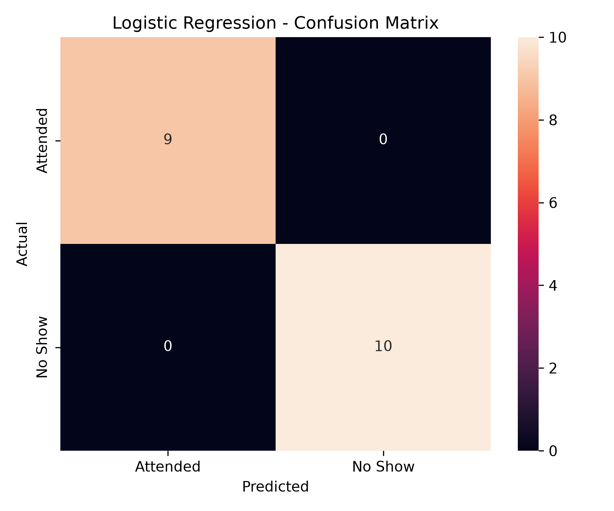
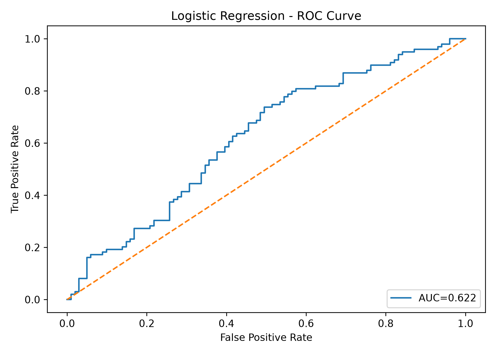
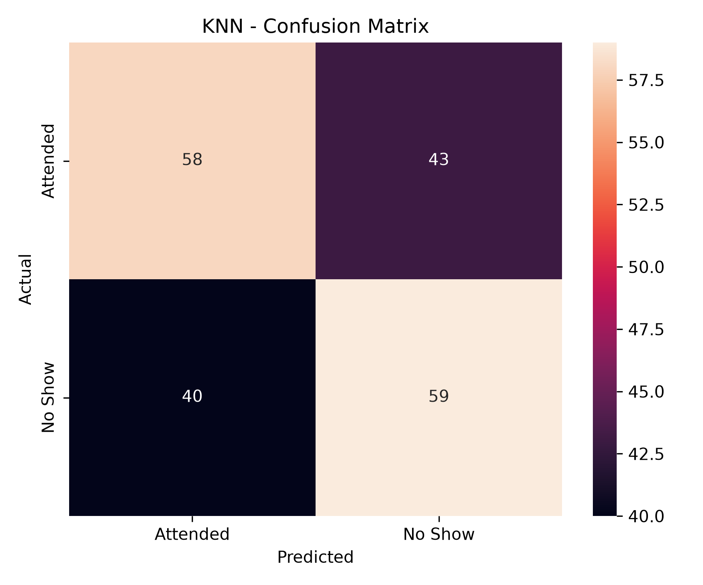
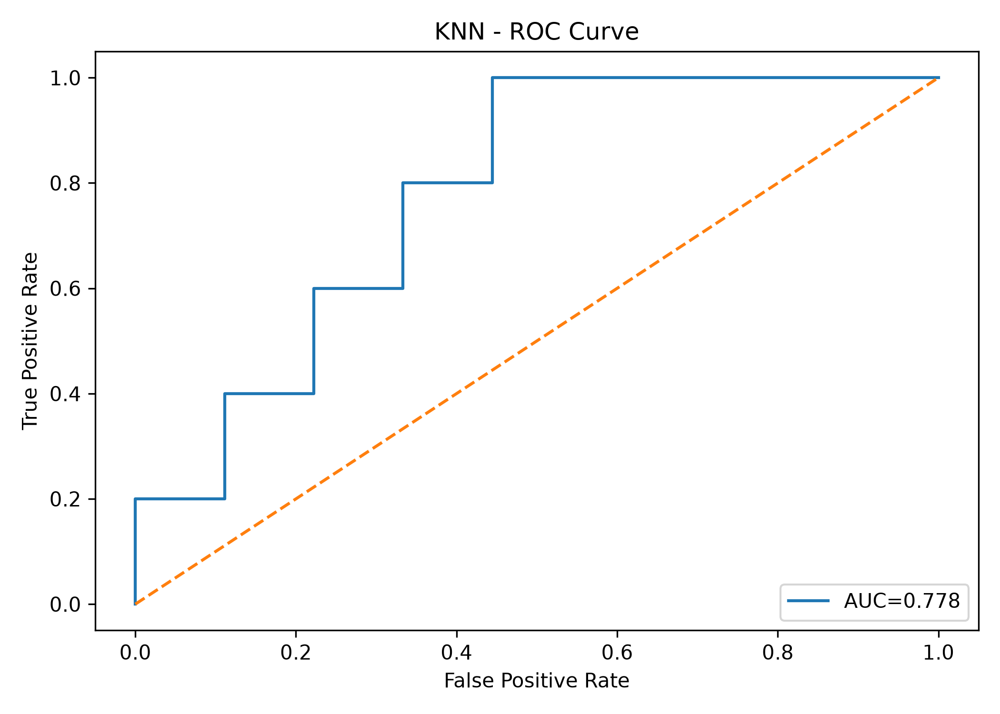

# SmartCare Hospital AI

Our AI-powered prediction system uses Machine Learning models such as Logistic Regression and K-Nearest Neighbors (KNN) to identify patients who are more likely to miss their appointments before the scheduled date. It helps healthcare providers understand potential no-shows, take early actions such as reminders or follow-ups, and improve appointment management.

### Task list
- [x] Training Logistic Regression model
- [x] Training KNN model
- [X] Track both model using `MlFlow`
- [x] Save Model Artifacts in [**Dagshub**](https://dagshub.com/heshan.thilakawardena/smartcare-noshow-ai/experiments)
- [ ] Data versioning using `dvc`
- [x] `SHAP` implement for Explanations
- [x] Frountend using `steamlit` + `Flask`

### Usage
- Download Code
- Run code in terminal
  ```
  python app.py
  ```

# Logistic Regression Model

### Confusion Matrix


### ROC


# Logistic Regression Model

### Confusion Matrix


### ROC


## System Architecture

```
                 User
                  |
                  |
             Streamlit UI
                  |
        Select Model Dropdown
                  |
                  |
        POST JSON Request
                  |
                  ↓
            Flask API
                  |
        --------------------
        |                  |
 Logistic Regression      KNN
        |                  |
 Smartcare_Logistic     Smartcare_KNN
        |                  |
        --------------------
                  |
                  ↓
      Smartcare_Preprocessor.joblib
                  |
                  ↓
              Prediction
                  |
                  ↓
                 SHAP
                  |
                  ↓
          Result back to UI
```